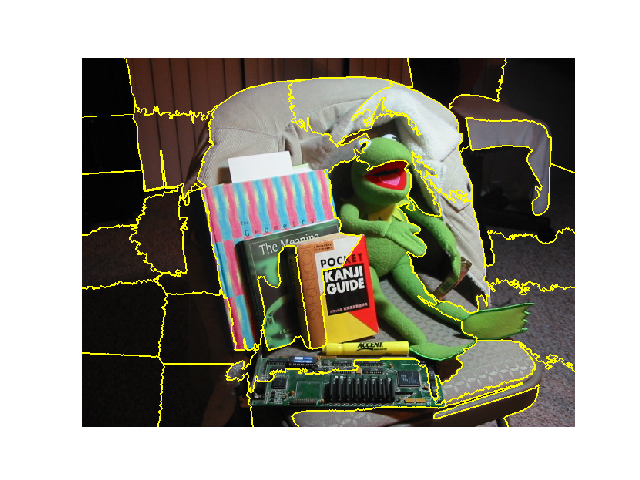

# Weekly Report
**Number:6  
Adviser: Prof. Yang Wen  
Student: Cheng Wensheng  
Period: 2018.1.21-2018.1.28**
## Recap
This week I mainly put my effort on the project. Motivated by senior Wang Jinwang, who showed me Ru Hui's project of superpixel segmentation, I tried this. 
## Superpixel 
* Superpixel is a group of pixels which have similar properties. It can be used to do image segmentation. It's better than moving window, cause it can fit the irregular edges of regions.
* Common superpixel algorithms include SLIC(2010), SEEDS(2013), and SLIC has the best comprehensive performance of all. In our project, I mainly use SLIC.
* Since this is a engineering project, I need to implement it. Relative algorithms are provided in Scikit-image, an image processing python package, as well as OpenCV-Python. However, for SLIC algorithm, only SKImage has specific tutorials, while OpenCV-Python doesn't. With the help of senior Wang,I make it with OpenCV-Python. This is the result of test image with SKImage. 

    

 

    

## Classification
* With no hesitation, for conventional methods, I choose SIFT+BoW+SVM. I use the remote sensing dataset `UCMerced_LandUse` , which has 21 classes of remote sensing images. I adopt Forest, Denseredidential, Rivers and other images. 
* The pipeline is `SLIC-> SIFT-> BoW-> SVM`. The final output should be a pseudo color which is colored with corresponding classes.
* I finish the whole framework. Then I plan to use some large remote sensing images to see the performance.