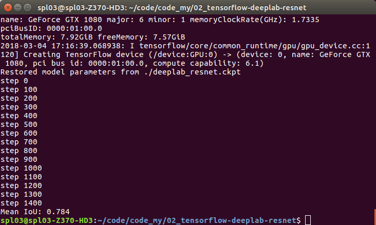

# Weekly Report
**Number:1  
Adviser: Prof. Yang Wen  
Student: Cheng Wensheng  
Period: 2018.2.26-2018.3.4**
## Recap
Since the 54th research institute project still performs poorly, I mainly put my effort on the project this week, and I'm mainly responsible for the semantic segmentation part.
## Programming Environment
* With a new super PC equipped with GPU GTX 1080, the first thing to do is to configure the programming environment. With the help of Senior Wang, Ubuntu 16.04 system, CUDA, CuDNN, etc., have been installed well. As for Deep Learning framework, I use TensorFlow for now. Later I will install Caffe to reimplement classical networks.  
## DeepLab V2
* The state-of-the-art semantic segmentation algorithms with code available is `DeepLab V2`. So I try to reimplement this first. 
* The paper author provides Caffe code, and there are people who convert the original Caffe model to TensorFlow model and get equivalent performance, so I use the TensorFlow-version code.
* After trying and configuring files for days, I get the code run properly. The outcome fulfills my expectations and achieves the accurancy given by the TensorFlow-version code author, which is `mIoU= 78.4%`.

 

    

## Notes
* When I first run the code on my Microsoft PC, it reports error which means the GPU memory has been exhausted, although GTX 1080 has 8G memory. So I decrease the `batch_size` to train it properly. Also, I think the original `batch_size` may get better performance for mini-patch gradient descent algorithm.
* Every training takes about 3 hours, maybe I can try multi-GPU method to get time shorter.